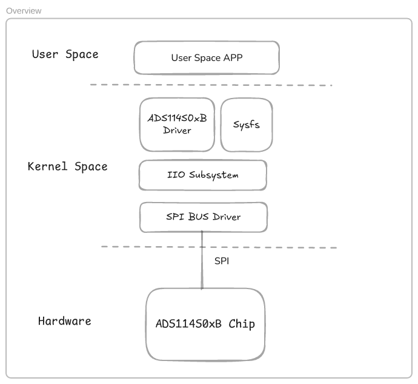

# ADS114S0xB Delta-Sigma ADC

## Overview

This project provides a device driver and a user-space application for the 
**Texas Instruments ADS114S0xB** series of Delta-Sigma ADCs. 
These ADCs are designed to measure low-voltage signals with high precision, 
making them suitable for sensor transducers, temperature controllers, 
and other industrial applications.

The driver implements a **Linux Industrial I/O (IIO) framework**-based SPI 
interface for the ADS114S0xB ADC, allowing user-space applications to communicate 
with the hardware efficiently. The user-space application demonstrates how to 
interact with the ADC, configure its settings, and retrieve voltage readings.

## Features

- Support for ADS114S06B and ADS114S08B models
- SPI-based communication using the Linux IIO framework
- Support for channel selection
- Exposed registers for read/write configurations
- User-space application to trigger ADC conversions and read results

## How the ADS114S0xB ADC Works

The **ADS114S0xB** series ADCs include a **multiplexer (mux)** that allows 
selection of different input channels. However, only 
**one channel can be converted at a time**. 
Before starting a conversion, the **INPMUX register must be configured properly** 
to select the desired channel. The ADC then performs a conversion and 
outputs the digital result over SPI.

### Key Functional Components

- **Analog Multiplexer**: Selects one of the available input channels.
- **Programmable Gain Amplifier (PGA)**: Amplifies low-level signals for better resolution.
- **16-bit Delta-Sigma ADC**: Converts the selected channel's voltage into a digital value.
- **Voltage Reference Selection**: Can use an internal 2.5V reference or an external reference.
- **SPI Communication**: Used to send commands and receive conversion results.

## Main Code Components

### Kernel Device Driver (`ti-ads114s0xb.c`)

The driver provides an interface for the ADC through the **Linux IIO subsystem**. It includes:

- SPI communication handlers
- Channel configuration using INPMUX
- Data retrieval through IIO buffer mechanisms
- Integration with the Linux IIO framework

### User-Space Application (`user-space-app.cpp`, `ADS114S0XB.h` and `IIOSysfsFilesUtil.h`)

The user application interacts with the device driver via **libiio**. It:

- Initializes the ADC
- Configures the desired channel
- Triggers a conversion
- Reads and displays the acquired voltage data
  
#### Device Driver and User Application

### Goals and Key Driver Components

A driver that performs the following:

- Initialization of device
- Exercise valid SPI read/write operations
- Ability to Read/Write to all registers on the device
- Read valid ADC values from the device

### User Space Application
A user space application that interacts with the developed driver should be created that shows:

- How to read ADC values
- How to read register values
- How to change ADC channels

### System Design

The ADS114S0xB driver was designed to run on linux. Since the chip communicates using the SPI bus,
the device driver binds to a SPI bus driver. The instance of the SPI bus is chosen on the device tree.

The IIO subsystem was designed to support devices like the ADS114S0xB ADC and it is pertty much
a standard for such devices.

It also provides a standard way to create sysfs interfaces with the user space. It also allows us
to create custom sysfs interfaces. For this exercise, I created a custom attribute file for each 
register that can be read or written. Only for the sake of the exercise.
Normally that is not necessary, usually the registers are managed internally by the device driver
ant it takes care of the values being read from and write to the registers.
For example, this chip has a register called INPMUX. One channel can be converted at a given time,
and that register is used to select one of the channels to be converted. It is not necessary to 
expose it however I found that would be a great thing to add to the demonstration, read and write
the registers from the user space.
In normal implementations, the users are able to select the desired channel by setting the corresponding
voltageX_en file and then reading its corresponding voltageX_raw to obtain the ADC values.

Before starting talking about the implementation, let's take a look at the system design figure below:



### Device Driver Implementation

It is the ADS114S0xB Driver block in the figure above. Let's explain the internal code.
#### Initialization
```cpp
static int ads114s0xb_probe(struct spi_device *spi)
{
	struct ads114s0xb_private *ads114s0xb_priv;
	struct iio_dev *indio_dev;
	int ret;
	const struct spi_device_id *spi_id = spi_get_device_id(spi);

	pr_info("ads114s0xb: Probing SPI driver\n");

	/* Allocate IIO device */
	indio_dev =
	    devm_iio_device_alloc(&spi->dev, 
		sizeof(struct ads114s0xb_private));
	if (!indio_dev)
		return -ENOMEM;

	ads114s0xb_priv = iio_priv(indio_dev);
	ads114s0xb_priv->mock_flag = 0;
	ads114s0xb_priv->mock_data = 0;
	ads114s0xb_priv->spi = spi;
	ads114s0xb_priv->chip_info = 
		&ads114s0xb_chip_info_tbl[spi_id->driver_data];
	ads114s0xb_priv->reset_gpio =
	    devm_gpiod_get_optional(&spi->dev, "reset", GPIOD_OUT_LOW);
	if (IS_ERR(ads114s0xb_priv->reset_gpio))
		dev_info(&spi->dev, "Reset GPIO not defined\n");

	mutex_init(&ads114s0xb_priv->lock);

	indio_dev->info = &ads114s0xb_info;
	indio_dev->name = spi_id->name;
	indio_dev->modes = INDIO_DIRECT_MODE | INDIO_BUFFER_TRIGGERED;

	indio_dev->channels = ads114s0xb_priv->chip_info->channels;
	indio_dev->num_channels = ads114s0xb_priv->chip_info->num_channels;

	ret = devm_iio_triggered_buffer_setup(&spi->dev, indio_dev, NULL,
		ads114s0xb_trigger_handler, NULL);
	if (ret) {
		dev_err(&spi->dev, "iio triggered buffer setup failed\n");
		return ret;
	}
	
	/* Register IIO device */
	ret = devm_iio_device_register(&spi->dev, indio_dev);
	if (ret) {
		pr_err("ads114s0xb: Failed to register IIO device\n");
		return ret;
	}

	spi_set_drvdata(spi, indio_dev);
	pr_info("ads114s0xb: SPI driver successfully registered\n");

	ads114s0xb_reset(indio_dev);

	return 0;
}
```
The `ads114s0xb_probe(struct spi_device *spi)` does the initialization. It registers the module,
binds with the SPI bus driver and reset the chip. 
Note that I connected it to a ficticious reset GPIO pin since at the moment the sensor is not available 
and wiring up is not at the current scope.
I also created a trigger handle using the IIO API `devm_iio_triggered_buffer_setup`. That enables
the `ads114s0xb_trigger_handler` to be called when buffered ADC data is requested from
user space. More details about this will be covered later.

#### Handling custom attibutes

The `ads114s0xb_attr_get` and `ads114s0xb_attr_set` are used to handle events of read/write to the
custom attibutes that were created. I created a custom attribute for each corresponding chip register.
A sysfs file is created bu the IIO subsustem and read or write operations are handled by those two handlers.
For example, I created the custom attribute DATARATE. If the user calls `echo 3 > DATARATE`, the handler
`ads114s0xb_attr_set` will be called. I associated to each attribute its corresponding register address.
Exanple:
```cpp
//           Register address associated with the arribute
//                            |
IIO_RW_ATTRIBUTE(ID, ADS114S0XB_REGADDR_ID);
IIO_RW_ATTRIBUTE(STATUS, ADS114S0XB_REGADDR_STATUS);
IIO_RW_ATTRIBUTE(INPMUX, ADS114S0XB_REGADDR_INPMUX);
```
From the handler, it uses `iio_attr->address` to know which the address previously associated of the register that should be written. Likewise for the
`ads114s0xb_attr_get`.
```cpp
static ssize_t ads114s0xb_attr_get(struct device *dev,
				   struct device_attribute *attr, char *buf)
{
	struct iio_dev *indio_dev = dev_to_iio_dev(dev);
	struct iio_dev_attr *iio_attr = to_iio_dev_attr(attr);
	int ret;
	u8 val;

	pr_info("ads114s0xb: Attribute %s to be read\n", attr->attr.name);
	ret = ads114s0xb_read_reg(indio_dev, (u8)(iio_attr->address), &val);
	pr_info("ads114s0xb: ads114s0xb_read_reg ret = %d, val = %x\n", ret, val);

	return scnprintf(buf, PAGE_SIZE, "%u\n", val);
}

static ssize_t ads114s0xb_attr_set(struct device *dev,
				   struct device_attribute *attr,
				   const char *buf, size_t count)
{
	struct iio_dev *indio_dev = dev_to_iio_dev(dev);
	struct ads114s0xb_private *ads114s0xb_priv = iio_priv(indio_dev);
	struct iio_dev_attr *iio_attr = to_iio_dev_attr(attr);
	int val;

	pr_info("ads114s0xb: Setting attribute %s\n", attr->attr.name);

	if (kstrtoint(buf, 10, &val) < 0)
		return -EINVAL;
	if (val < 0)
		return -EINVAL;

	if (iio_attr->address == ADS114S0XB_REGADDR_INPMUX && 
		val >= ads114s0xb_priv->chip_info->num_channels) {
		pr_info("ads114s0xb: Channel %d does not exist for %s\n",
			val, indio_dev->name);
		return -EINVAL;
	}

	if (iio_attr->address == ADS114S0XB_REGADDR_MOCK) {
		ads114s0xb_priv->mock_flag = val;
		return 1;
	}

	mutex_lock(&ads114s0xb_priv->lock);
	ads114s0xb_write_reg(indio_dev, (u8)(iio_attr->address), val);
	mutex_unlock(&ads114s0xb_priv->lock);

	pr_info("ads114s0xb: Attribute %s set to %d\n", attr->attr.name, val);
	return count;
}
```

#### Mocking data mechanism

Notice that I also created a rudimentary mechanism to mock sensor data. Unfortunately at the moment 
I don't have the sensor to do real tests. The SPI read are getting zeros and It is convenient 
to mockup the data. However, even in situations where we do have the sensor for real tests,
it might be convenient to use such a mechanism to inject and simulate errors to guarantee the
downstream modules will handle different situations. Other ideas like having the capability
to specify what data we want the driver to send so that we test a specific test case. However I 
highly recommend to use those mocks in a separate complication. The production code should not
have the risk of some bug that sends unreal data.
```cpp
static int ads114s0xb_read_raw(struct iio_dev *indio_dev,
			       struct iio_chan_spec const *chan, int *val,
			       int *val2, long mask)
{
	struct ads114s0xb_private *ads114s0xb_priv = iio_priv(indio_dev);
	int ret;

	mutex_lock(&ads114s0xb_priv->lock);
	switch (mask) {
	case IIO_CHAN_INFO_RAW:
		pr_info("ads114s0xb: Reading channel %d\n", chan->channel);
		ret = ads114s0xb_write_reg(indio_dev, 
			ADS114S0XB_REGADDR_INPMUX,
			chan->channel);
		if (ret) {
			dev_err(&ads114s0xb_priv->spi->dev, 
				"Set ADC CH failed\n");
			goto output;
		}
		ret = ads114s0xb_write_cmd(indio_dev, ADS114S0XB_CMD_START);
		if (ret) {
			dev_err(&ads114s0xb_priv->spi->dev, 
				"Start conversions failed\n");
			goto output;
		}
		
		mdelay(407);

		*val = ads114s0xb_read(indio_dev);

		*val = 42;

		ret = ads114s0xb_write_cmd(indio_dev, ADS114S0XB_CMD_STOP);
		if (ret) {
			dev_err(&ads114s0xb_priv->spi->dev, 
				"Stop conversions failed\n");
			goto output;
		}

		ret = IIO_VAL_INT;
		break;
	default:
		ret = -EINVAL;
		break;
	}
output:
	mutex_unlock(&ads114s0xb_priv->lock);
	return ret;
}
```

#### Read a channel

An important handler to mention is the `ads114s0xb_read_raw`. It is invoked when the user reads
the channle's corresponding sysfs file. For example, `cat in_voltage2_raw` will invoke the 
`ads114s0xb_read_raw` handler. The parameter chan will have the index of the channel. In this case
in the will be 2. Which corresponds to the chip's channels 2 (from 0 to 6 or 12). The `ads114s0xb_read_raw`
send via SPI command to set the channel to INPMUX register, sends the SPI start command to the chip.
The chip will start coverting (it will have some delay described in the datasheet), and a command
to read the SPI will acquired the channel data. After that it sends via SPI the stop command.

#### Read triggered and buffered

I added another feature that is the user triggered data read. It creates a buffer and the user
is able to trigger the driver to send more ADC data. In that scenario, the user first selects
the channel via `scan_elements/in_voltageX_en` sysfs file. For example, `echo 1 > scan_elements/in_voltage5_en` 
will call the handler `ads114s0xb_update_scan_mode`. 
It can be implemented something like after a trigger, it reads like 100 samples so the user space app can do
an averaging or anything else. And the user space would have the capability to do it to each channel.
However, in the perspective of signal processing, it is not desirable to have jitter in the sampling. This
process that I mentioned above would probably have jitter. The sampling would be uneven adding undesired signal
distortion.
We are not also coverint the differencial channels and other capabilities of the chip at this exercise, however
I am just mentioning that this might be a possibility we have with thise mechaninsm. The IIO framework is great!
I created this user trigger. However, it can be triggered from the ready signal
from the chip. There are many options to explore.
It is important to mention that this chip does not have internal fifo. It just converts and put the data on the
internal shift register to serialize the data in the SPU bus. This chip set with the maximum sampling rate,
which is 4KSps would generate a 2-byte sample data ready every 250 microseconds. 
A SPI with DMA support could be an option depending on the constraints of the hardware.
```cpp
static int ads114s0xb_update_scan_mode(struct iio_dev *indio_dev,
	const unsigned long *scan_mask)
{
	struct ads114s0xb_private *ads114s0xb_priv = iio_priv(indio_dev);
	int i, enabled_channel = -1;

	pr_info("ads114s0xb_update_scan_mode\n");

	mutex_lock(&ads114s0xb_priv->lock);

	/* Find the first enabled channel */
	for (i = 0; i < ads114s0xb_priv->chip_info->num_channels; i++) {
		if (test_bit(i, scan_mask)) {
			enabled_channel = i;
			break;
		}
	}

	if (enabled_channel >= 0) {
		ads114s0xb_write_reg(indio_dev, ADS114S0XB_REGADDR_INPMUX, 
			enabled_channel);
		dev_info(&ads114s0xb_priv->spi->dev, 
			"Enabled ADC channel %d\n", enabled_channel);
	} else {
		ads114s0xb_write_reg(indio_dev, 
			ADS114S0XB_REGADDR_INPMUX, 0x00); // Default
		dev_info(&ads114s0xb_priv->spi->dev, 
			"Set the default (0) channel\n");
	}

	mutex_unlock(&ads114s0xb_priv->lock);
	return 0;
}
```
On `ads114s0xb_update_scan_mode` handler, a **scanmask**
is passed to the handler so that we may test what are the channels enabled. In that case it will
find that the channel 5 was enabled. If the channel 2 was previously selected and it was not
set back to zero, setting the channel 5 will not make any effect in the driver version.

```cpp
static irqreturn_t ads114s0xb_trigger_handler(int irq, void *private) {
	struct iio_poll_func *pf = private;
	struct iio_dev *indio_dev = pf->indio_dev;
	struct ads114s0xb_private *ads114s0xb_priv = iio_priv(indio_dev);

	pr_info("ads114s0xb_trigger_handler: Called");

	ads114s0xb_write_cmd(indio_dev, ADS114S0XB_CMD_START);
	
	ads114s0xb_priv->buffer[0] = ads114s0xb_read(indio_dev);
	// Mock
	if (ads114s0xb_priv->mock_flag != 0) {
		memcpy(&ads114s0xb_priv->buffer[0],
			&ads114s0xb_priv->mock_data,
			sizeof ads114s0xb_priv->mock_data);
		ads114s0xb_priv->mock_data++;
	}

	ads114s0xb_write_cmd(indio_dev, ADS114S0XB_CMD_STOP);

	iio_push_to_buffers_with_timestamp(indio_dev, ads114s0xb_priv->buffer, 
		iio_get_time_ns(indio_dev));
	iio_trigger_notify_done(indio_dev->trig);
	return IRQ_HANDLED;
}
```

Once the channel is properly selected and the buffer is set in the IIO subsystem by
calling `echo 1 > buffer/enable`, every write to 
`"/sys/bus/iio/devices/" + SYSFS_TRIGGER_INSTANCE + "/trigger_now"` will call the `ads114s0xb_trigger_handler`. 
That handler will call the read data
from ADC via SPI command to acquire the data in between start and stop conversion commands to
the chip. It timestamps the data and sends to the buffer stream to user space.
The user space reads it via `/dev/iio:device0` (or other device name, depending on the instance created).

#### User Space App Implementation

I created the most simple thing possible. I created the ADS114S0XB class to interface with the sysfs and IIO interface. It has simple methods to do the necessary operations to read/wirte registers via custom attribute files, it also has methods to select the channels and read ADC data.
I created the IIOSysfsFileUtil.h to be used by the ADS114S0XB. It handles the sysfs constant strings and some
sysfs utils. It can be used by other drivers too. 
I avoided to use exceptions. Only one thrown in the code, but the idea is to not having any exception.
Normally we keep a better control of the status more directly in codes that need to be safe. What do you
think about it ? Good subject for discussion. I particularly like the StatusOr approach.
See [Class StatusOr<T>](https://cloud.google.com/cpp/docs/reference/common/latest/classgoogle_1_1cloud_1_1StatusOr) for more details.
Overall the ADS114S0XB is pretty simple and straight forward as it should be, no fancy design was necessary. Normally we do the best to make simple solutions even to complex problems as much as possible. In this case there is no complexity in this level of the design.

And last but not least, the `user-space-app.cpp` has the main function. Again, something pretty simple and straight foward for the exercise.
```cpp
int main() {
  using namespace adcs;
  ADS114S0XB adc;
  auto initStatus = adc.initialize();

  if (initStatus.first != 0) {
    std::cerr
      << "ADS114S0XB initialize error ("
      << initStatus.second << "): "
      << strerror(initStatus.first)
      << std::endl;
  }

  enableDriverMockSensor(adc);
  
  auto channel = 3;
  // How to read ADC values / How to change ADC channels
  // Read 20 samples
  readAdcData(adc, channel, 20);
  // How to read register values
  readRegisters(adc);
  // How to write register values
  writeRegisters(adc);
 
  return EXIT_SUCCESS;
}
```


### Configuration and Initialization Scripts
The project includes a script to assist with configuring and initializing the ADS114S0XB device. 
The script provides a menu with the following options:

```
==================================
 ADS114S0XB Configuration Menu
==================================
1. Load required modules
2. Load ADS114S0XB driver
3. Install ADS114S0XB driver
4. Configure IIO interface
5. Unload ADS114S0XB driver
6. Exit
==================================
```

The script automates essential setup tasks, ensuring that the driver is properly installed and 
the IIO interface is configured before data acquisition.

**Important Notes:**
- **Options 1 to 4 are necessary** for setting up the environment before using the ADC.
- The script should be **executed as root** to ensure proper module loading and driver installation.

The project includes a script to assist with configuring and initializing the ADS114S0XB device. 
The script provides a menu with the following options:

## Usage

### Building and Loading the Kernel Module

```sh
make
sudo insmod ti-ads114s0xb.ko
```

### Running the User-Space Application

```sh
g++ user-space-app.cpp -o user-space-app -liio
./user-space-app
```

### Configuring and Reading ADC Values

Once the driver is loaded, the ADC can be configured using the **sysfs** 
interface provided by the IIO framework or by using the user-space application.

## Directory Structure

```
.
├── device-tree
│   ├── ads114xb-overlay.dtbo
│   └── ads114xb-overlay.dts
├── LICENSE
├── linux-embedded-driver
│   ├── Makefile
│   ├── README.md
│   └── ti-ads114s0xb.c
├── linux-user-app
│   ├── ADS114S0XB.h
│   ├── IIOSysfsFilesUtil.h
│   ├── Makefile
│   ├── README.md
│   └── user-space-app.cpp
├── README.md
├── scripts
│   ├── config_menu.sh
│   └── README.md
└── tests
    ├── buffer_reading_from_app.txt
    ├── channel_set_buffer_read.txt
    ├── dmesg_log.txt
    ├── drafts.txt
    ├── linux-user-app-evidence.txt
    ├── parameter_validation_evidences.txt
    ├── README.md
    └── registration_evidences.txt
```

## References
For more details, refer to the [ADS114S0xB Datasheet](https://www.ti.com/lit/ds/symlink/ads114s08b.pdf).

